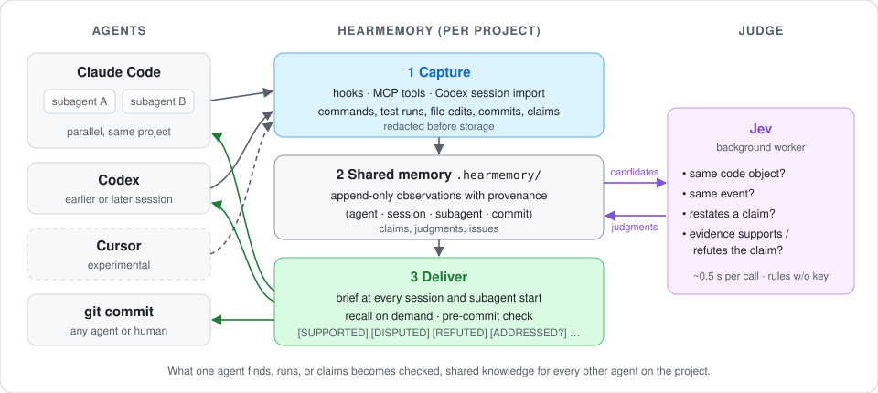

# HearMemory

[English](README.md) | 简体中文

**为多 agent 协同编程设计的共享记忆：并行的子 agent、以及在 Codex、Claude Code、Cursor 之间接力的 agent 共用同一份项目记忆，由又小又快的判断模型 Jev 拿真实证据（测试结果、代码改动、提交记录）核对每个 agent 的说法，让下一个 agent 知道哪些能信。**

<p align="center">
  
</p>

## 概述

HearMemory 记录编程 agent 在项目中的操作（命令、测试结果、文件改动、提交）和结论（"已修复 X"、"测试通过"）。后台 worker 就这些记录向 Jev 提出几类明确的判断问题：两处提及是否指同一代码对象，两条记录是否为同一事件，一条说法是否复述另一条，已记录的证据是否支持或推翻某条说法。每个新会话和新的子 agent 启动时都会收到一份简报，包含其他 agent 的发现和每条说法的核实状态；每次 `git commit` 前也会对照共享记忆进行检查。

## 特性

- **多 agent 协同。** 并行的子 agent 实时看到彼此的结果；先后接手的 agent（包括不同厂商的 agent）从上一个 agent 停下的地方继续。
- **基于证据的说法核实。** 每条说法根据独立的测试运行、代码改动和提交被标记为 `SUPPORTED`、`DISPUTED`、`REFUTED`、`SAME-SOURCE ONLY` 等状态，并附完整出处（agent、会话、子 agent、提交）。
- **快速、低成本的判断器。** Jev 单次判断约 0.5 秒（基准测试中位数），一次完整工作会话的花费远低于 1 美分。未配置 API 密钥时自动退回确定性规则。
- **提交前检查。** 依赖已被推翻的说法、涉及存在未决问题的文件、或紧随失败测试的提交，会按配置给出提醒或被拦截。
- **项目内隔离。** 所有文件都在项目目录内，从不修改全局 agent 配置；`hearmemory uninstall` 可撤销全部改动。
- **核心零依赖。** 核心只使用 Python 标准库；Jev 客户端（`typesafe-sdk`）为可选依赖。

## 支持的宿主

| 宿主 | 接入方式 | 状态 |
|---|---|---|
| Claude Code | MCP 服务、hooks（会话开始、工具结果、子 agent、提交前） | 已支持 |
| Codex CLI | MCP 服务、`AGENTS.md` 指令、会话记录导入 | 已支持 |
| Cursor | MCP 服务、hooks、项目规则 | 实验性 |
| git | pre-commit hook | 已支持 |
| 任意 MCP 客户端 / shell | MCP 工具与命令行 | 已支持 |

运行环境：macOS 或 Linux，Python 3.11 及以上。

## 安装

安装到需要使用它的项目的虚拟环境中：

```sh
pip install "hearmemory[jev] @ git+https://github.com/ssd1051/hearmemory"
```

不加 `[jev]` 则不安装 Jev 客户端（仅规则模式）。安装后提供两个等价命令：`hearmemory` 和 `hmem`。

## 快速开始

```sh
cd your-project
python3 -m venv .venv
.venv/bin/pip install "hearmemory[jev] @ git+https://github.com/ssd1051/hearmemory"
.venv/bin/hearmemory init --hosts claude,codex,git
export TYPESAFE_API_KEY=...                  # 可选；启用 Jev 判断器

sh .hearmemory/host/claude/launch.sh         # 带 HearMemory 启动 Claude Code
sh .hearmemory/host/codex/launch.sh          # 或带 HearMemory 启动 Codex
```

随时查看共享记忆：

```sh
hearmemory recall --brief        # 新会话会收到的简报
hearmemory recall "div"          # 检索记忆
hearmemory status                # 记录数量、判断器状态、当日花费
```

## 宿主接入

### Claude Code

```sh
sh .hearmemory/host/claude/launch.sh     # 等价于 claude --mcp-config ... --settings ...
hearmemory host claude-cmd               # 打印完整启动命令
```

启动脚本仅为本次会话加载 MCP 服务和 hooks。若希望在项目内直接运行 `claude` 时也加载 HearMemory，使用 `hearmemory init --claude-persist`，它会在项目的 `.mcp.json` 和 `.claude/settings.local.json` 中添加条目。

### Codex CLI

```sh
sh .hearmemory/host/codex/launch.sh      # 其余参数原样传给 codex
hearmemory host codex-cmd                # 打印 `codex -c ...` 启动命令
```

`hearmemory init` 会在 `AGENTS.md` 中加入一段带标记的指令，要求 Codex 启动时读取简报、记录结论、提交前运行 `hearmemory check`。Codex 的操作从其会话记录（`~/.codex/sessions`）只读导入，导入时机为：启动脚本退出时、后台 worker 定期执行、以及每次调用 HearMemory 工具之前。`hearmemory init` 之前已结束的会话默认跳过，可用 `hearmemory import codex --since <时间>` 或 `--all-history` 补录。

### Cursor（实验性）

```sh
hearmemory init --hosts cursor
```

写入 `.cursor/mcp.json`、`.cursor/hooks.json` 和 `.cursor/rules/hearmemory.mdc`。

### git 提交前检查

`git` 宿主会安装一个 pre-commit hook，将暂存的改动与共享记忆对照检查。默认模式为 `warn`；可在 `.hearmemory/config.toml` 的 `[precommit]` 中通过 `<宿主>_mode` 设置 `off`、`warn`、`hold_once` 或 `block`。已有的 pre-commit hook 会被保留并优先执行。设置 `HEARMEMORY_DISABLE=1` 可让单条命令跳过所有 hooks。

### 命令行与 MCP 工具

| 命令行 | MCP 工具 | 用途 |
|---|---|---|
| `hearmemory recall [query] [--brief]` | `hearmemory_recall` | 获取简报或检索 |
| `hearmemory record --kind claim\|issue\|note "..."` | `hearmemory_record` | 记录结论、问题或备注 |
| `hearmemory check --staged` | `hearmemory_check` | 提交前检查 |
| `hearmemory issues` | `hearmemory_issues` | 未决问题 |
| `hearmemory status` | `hearmemory_status` | 存储、判断器与 worker 状态 |

## 示例：Codex → Claude Code 子 agent → Codex

以下为一个小型 Python 项目上的真实运行记录，输出有删节。

**1. Codex 新增 `sub()` 并提交。** HearMemory 导入该会话：提交前的测试运行、代码改动以及提交本身。

**2. Claude Code 启动并收到简报：**

```text
[hearmemory] Shared project memory — 2 items. Format: status · claim · source.
New from other agents:
- test `pytest` passed (12 passed) — codex · session 01a0d476 · 2m ago · 1dcbbe0+dirty → b1d916a
- [SAME-SOURCE ONLY] "Added sub(a, b) returning a - b with a test; python -m pytest -q passes all 12 tests." (the agent's own report) — codex · session 01a0d476 · 2m ago · 1dcbbe0+dirty → b1d916a
```

Claude Code 并行启动两个子 agent：A 重新运行测试，B 审查 `sub()` 的测试覆盖。两者都记录了结果：A 的测试运行作为 Codex 说法的独立证据存入记忆，B 记录了缺少负数、零和浮点数用例。

**3. 第二个 Codex 会话收到 B 的发现，补齐测试（16 passed）并提交。** 下一个会话收到的简报：

```text
[hearmemory] Shared project memory — 3 items. Format: status · claim · source.
New from other agents:
- [SUPPORTED] "python -m pytest -q: 12 passed, 0 failed at b1d916a …" — claude · session 0f684169 · subagent general-purpose · 6m ago · b1d916a
- [ADDRESSED?] "sub test coverage is insufficient. tests/test_calc.py has exactly one sub test, test_sub (sub(5, 3) == 2) …" → codex session 01a0d47d edited tests/test_calc.py, 16 passed, 1696a2b — claude · session 0f684169 · subagent general-purpose · 6m ago · b1d916a
```

三个会话共调用 Jev 7 次，总花费 $0.0004。

### 状态标签

| 标签 | 含义 |
|---|---|
| `[SUPPORTED]` | 有来自说法作者以外来源的证据支持。 |
| `[WEAK SUPPORT]` | 判断为支持，但置信度较低（默认低于 0.65）。 |
| `[SAME-SOURCE ONLY]` | 仅有作者本人的输出支持。 |
| `[UNVERIFIED]` | 尚未判断，或没有可对照的证据。 |
| `[INSUFFICIENT]` | 已判断；现有证据既不能支持也不能推翻。 |
| `[DISPUTED]` | 证据相互矛盾；同时自动开启一个问题。 |
| `[REFUTED]` | 与证据矛盾；同时列出反证。 |
| `[OUTDATED]` | 测试结果类说法，已被之后的代码改动和测试结果取代。 |
| `[ADDRESSED?]` | 已报告的问题，之后的改动和通过的测试可能已将其解决。 |
| `[ISSUE …]` | 未决问题，手动记录或因争议自动开启。 |

出处中的 `abc1234+dirty → def5678` 表示在 `abc1234` 上带未提交改动运行，随后提交为 `def5678`。设置 `brief.lang = "zh"` 可使用中文标签。

## 性能

### 判断质量

67 道判断题，覆盖 HearMemory 设计所基于的 12 类判断模板，由人工在不知道模型答案的情况下标注。题目为中文原题，每题另有英文译本。

| 判断器 | 准确率（中文） | 准确率（英文） | 危险错误¹（中 / 英） |
|---|---|---|---|
| **Jev**（jev-1.13.0） | 93.9%（62/66） | 94.0%（63/67） | 1 / 1 |
| 模型 A（推理模型） | 92.5%（62/67） | 95.5%（64/67） | 1 / 0 |
| 模型 B（推理模型） | 100%（67/67） | 98.5%（66/67） | 0 / 0 |
| 确定性规则 | 58.2%（39/67） | 58.2%（39/67） | 4 / 4 |

¹ 会造成下游危害的错误，例如把两个不同对象合并、或采纳已被推翻的说法。

### 延迟

同样 67 道题，逐条调用，各判断器交替进行。

| 判断器 | 中位数 | p90 | p95 | 输出 token 中位数 |
|---|---|---|---|---|
| **Jev** | **0.55 s** | **0.66 s** | **0.78 s** | 41 |
| 模型 A | 4.39 s | 15.4 s | 18.9 s | 234 |
| 模型 B | 6.17 s | 14.2 s | 16.3 s | 414 |

同题配对比较，Jev 比模型 A 快 7.9 倍（中位数），比模型 B 快 11.1 倍。

### 多 agent 协作

三个 LLM 编程 agent 协作完成带隐藏验收测试的多步骤工程任务。两类场景，分别进行全新运行和从中途存档继续运行，每种 5 个随机种子（每种配置共 20 次运行）。

| 共享记忆配置 | 预算内完成任务 | 使用了已被推翻说法的运行² | 每局判断花费 | 判断延迟中位数 |
|---|---|---|---|---|
| 无 | 9 / 20 | 0 / 5 | — | — |
| 共享原始记录，无判断 | 11 / 20 | 3 / 5 | — | — |
| 记忆 + 确定性规则 | 12 / 20 | 2 / 5 | — | — |
| **记忆 + Jev** | **12 / 20** | **0 / 5** | **$0.01–0.02** | **0.3 s** |
| 记忆 + 推理模型判断（模型 A） | 13 / 20 | 0 / 5 | ≈ $0.3 | 6.3 s |

² 指包含已被推翻说法的那类场景中，从存档继续的运行。

在第一类场景的全新运行中，使用 Jev 完成 4/5，无共享记忆仅完成 1/5。Jev 在任务成功率上与推理模型判断相当，而单次延迟约为其 1/20，判断花费约为其 1/15–1/30，整局用时也更短（平均 550 秒对 670 秒）。

### 实际花费

在真实会话中测得（Codex CLI → 带两个并行子 agent 的 Claude Code → Codex CLI）：每组会话调用 Jev 7–26 次，**总花费 $0.0004–0.0008**，家用网络下单次调用中位数 1.35 秒。撰写时的 Jev 价格：每百万输入 token $0.042，输出 token 免费。默认上限：每天 200 次调用、$0.05。

## 配置

配置文件为 `.hearmemory/config.toml`。

| 配置项 | 默认值 | 说明 |
|---|---|---|
| `jev.daily_call_cap` / `jev.daily_usd_cap` | `200` / `0.05` | 每日 Jev 上限（按 UTC 计） |
| `jev.max_calls_per_run` | `40` | worker 每轮最多调用次数 |
| `judge.b1_min_support_confidence` | `0.65` | 低于此置信度的支持显示为 `WEAK SUPPORT` |
| `privacy.send_to_jev` | `true` | 设为 `false` 完全停用 Jev |
| `privacy.exclude_globs` | `.env`、`*.pem`、`*secret*` 等 | 内容永不记录的文件 |
| `privacy.jev_exclude_globs` | 空 | 内容永不发送给 Jev 的路径 |
| `precommit.<host>_mode` | `warn` | `off`、`warn`、`hold_once` 或 `block`（宿主：`claude`、`codex`、`cursor`、`git`） |
| `brief.lang` | `en` | `en` 或 `zh` |

API 密钥只从环境变量 `TYPESAFE_API_KEY` 读取，从不写入磁盘。每次 Jev 请求只包含说法本身和最多 3 段脱敏后的证据摘录（每段不超过 800 字符），从不发送整个文件或完整日志。判断在后台 worker 中进行，不会阻塞 agent。

### 写入的文件

| 宿主 | 文件 |
|---|---|
| 全部 | `.hearmemory/`（记忆、配置、日志；已加入 `.git/info/exclude`） |
| claude | `.hearmemory/host/claude/{mcp.json,settings.json,launch.sh}`；使用 `--claude-persist` 时另有 `.mcp.json` 和 `.claude/settings.local.json` |
| codex | `AGENTS.md` 中一段带标记的指令、`.hearmemory/host/codex/launch.sh` |
| cursor | `.cursor/mcp.json`、`.cursor/hooks.json`、`.cursor/rules/hearmemory.mdc` |
| git | `.git/hooks/pre-commit`（串联已有 hook）、`.hearmemory/host/git/pre-commit` |

所有改动都记录在 `.hearmemory/install_manifest.json` 中。

## 卸载

```sh
hearmemory uninstall                 # 移除 hooks 和生成的文件，保留记忆
hearmemory uninstall --purge --yes   # 同时删除 .hearmemory/
pip uninstall hearmemory
```

## 开发

```sh
python3 -m venv .venv && .venv/bin/pip install -e ".[dev]"
.venv/bin/python -m pytest
```

测试套件（约 630 个测试）可离线运行，无需 API 密钥，包括单元测试、在临时 git 仓库中对命令行、MCP 服务和 hooks 的端到端测试，以及基于真实多 agent 会话记录的回放测试（`tests/test_replay_*.py`）。架构说明见 [docs/DESIGN.md](docs/DESIGN.md)，更新记录见 [CHANGELOG.md](CHANGELOG.md)。

## 许可证

MIT，见 [LICENSE](LICENSE)。
